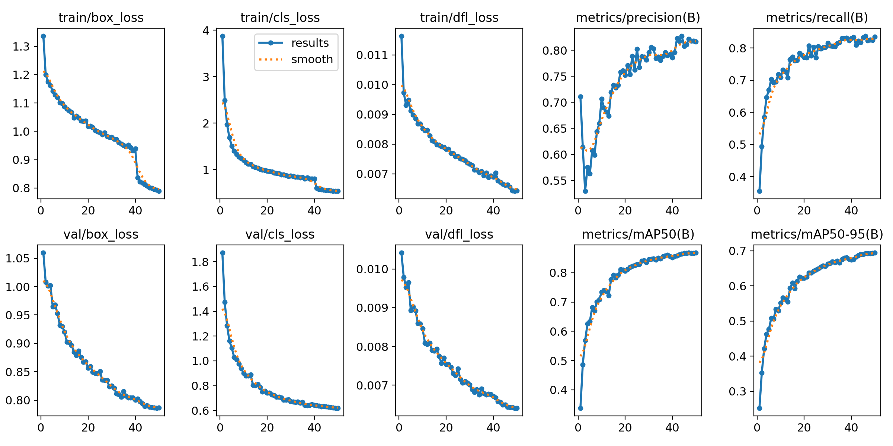
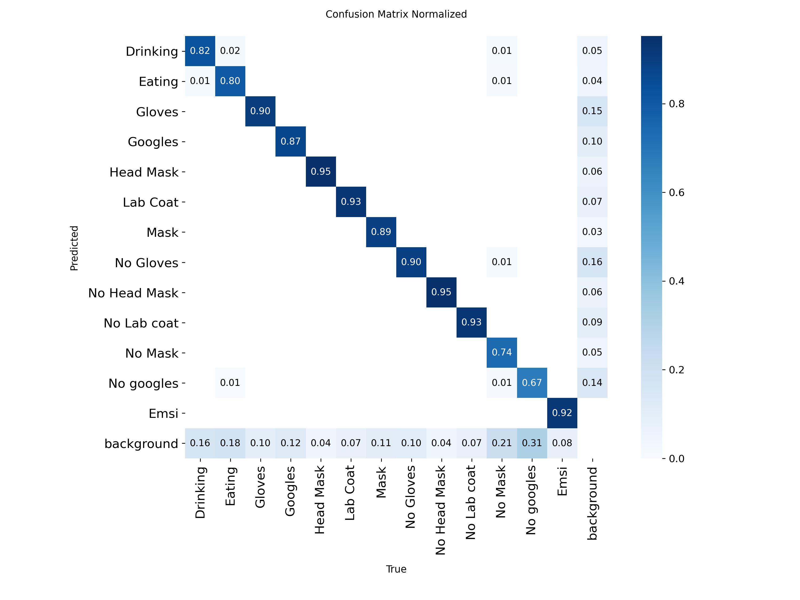

# 🛡️ MedGuard — Système Intelligent de Détection en Temps Réel des Équipements de Protection Médicale

Projet de Fin d'Année (PFA) — application de vision par ordinateur qui vérifie, à partir d'une image, d'une vidéo ou d'un flux webcam, si une personne porte l'ensemble des **Équipements de Protection Individuelle (EPI)** requis pour entrer dans une zone médicale / laboratoire stérile, et rend une **décision d'accès** automatique.

---

## ✨ Fonctionnalités

- **Détection d'objets YOLO** (Ultralytics) entraînée sur un jeu de données personnalisé d'EPI médicaux.
- **Trois modes d'analyse** dans l'interface Streamlit :
  - 📷 **Image** : upload d'une photo et analyse instantanée ;
  - 🎞️ **Vidéo** : analyse d'un fichier vidéo avec choix du pas d'échantillonnage et de la résolution de sortie ;
  - 🔴 **Temps réel** : flux webcam via WebRTC (`streamlit-webrtc`).
- **Décision sanitaire automatique** avec score de protection (0–100 %) :

  | Statut | Condition |
  |---|---|
  | ✅ **Accès Autorisé** | Les 5 EPI obligatoires sont détectés |
  | ⚠️ **Protection Incomplète** | Certains EPI ne sont pas confirmés |
  | 🚨 **Accès Refusé** | Absence explicite d'un EPI détectée (`No Mask`, `No Gloves`…) |
  | ⛔ **Accès Impossible** | Comportement interdit détecté (manger / boire) |

- **Accélération matérielle automatique** : Apple Silicon (MPS), CUDA ou CPU.
- Script de **data augmentation** pour enrichir le jeu de données.

## 🧠 Classes détectées

| Type | Classes |
|---|---|
| EPI présents | `Mask`, `Gloves`, `Head Mask`, `Lab Coat`, `Googles` |
| EPI absents | `No Mask`, `No Gloves`, `No Head Mask`, `No Lab coat`, `No googles` |
| Comportements interdits | `Eating`, `Drinking` |
| Ignoré | `Emsi` (logo) |

**EPI obligatoires :** masque, gants, charlotte / couvre-chef, blouse médicale, lunettes de protection.

## 📊 Entraînement & résultats

- Modèle de base : `yolo26n.pt` (Ultralytics)
- 50 epochs · batch 16 · images 640×640

Résultats sur le jeu de validation (dernière epoch, `runs/detect/Lab`) :

| Precision | Recall | mAP@50 | mAP@50-95 |
|---|---|---|---|
| 0.817 | 0.835 | 0.868 | 0.694 |

<p align="center">
  
</p>
<p align="center">
  
</p>

## 📁 Structure du projet

```
Projet_PFA/
├── main.py              # Application Streamlit principale (image, vidéo, temps réel)
├── streamlit.py         # Version alternative de l'interface
├── index.ipynb          # Test du modèle sur webcam avec OpenCV
├── ajout.py             # Script de data augmentation (rotation, flip, bruit, zoom…)
├── index.py             # Utilitaire de renommage d'images
├── rename.ipynb         # Notebook de renommage
├── model/               # Différents poids entraînés (best_final.pt, best_Safety.pt…)
├── runs/detect/Lab/     # Résultats d'entraînement + poids (weights/best.pt)
├── Lab/                 # Résultats d'un autre entraînement
├── best.pt / yolov8n.pt # Poids YOLO
├── pyproject.toml       # Dépendances (uv)
└── uv.lock
```

## 🚀 Installation

Prérequis : **Python ≥ 3.13** et [uv](https://docs.astral.sh/uv/) (recommandé).

```bash
git clone https://github.com/AlaeLahbichi/Syst-me-Intelligent-de-D-tection-en-Temps-R-el-des-quipements-de-Protection-M-dicale.git
cd Syst-me-Intelligent-de-D-tection-en-Temps-R-el-des-quipements-de-Protection-M-dicale

# Avec uv
uv sync

# Ou avec pip
python -m venv .venv
source .venv/bin/activate      # Windows : .venv\Scripts\activate
pip install ultralytics streamlit streamlit-webrtc av opencv-python pillow numpy torch
```

> ⚠️ Dans `main.py` (et `streamlit.py`), la variable `MODEL_PATH` contient un chemin absolu. Adaptez-la à votre machine, par exemple :
> ```python
> MODEL_PATH = "runs/detect/Lab/weights/best.pt"
> ```

## ▶️ Utilisation

**Application web :**

```bash
uv run streamlit run main.py
```

Puis ouvrez http://localhost:8501 et choisissez le mode d'analyse dans la barre latérale.

**Data augmentation :**

```bash
python ajout.py --input_dir ./images --output_dir ./augmented --prefix img
```

## 🛠️ Technologies

- [Ultralytics YOLO](https://docs.ultralytics.com/) — détection d'objets
- [PyTorch](https://pytorch.org/) — backend deep learning
- [Streamlit](https://streamlit.io/) + [streamlit-webrtc](https://github.com/whitphx/streamlit-webrtc) — interface web et flux temps réel
- [OpenCV](https://opencv.org/), [Pillow](https://python-pillow.org/), NumPy — traitement d'images

## 👤 Auteur

**Alae Lahbichi** — Projet de Fin d'Année
